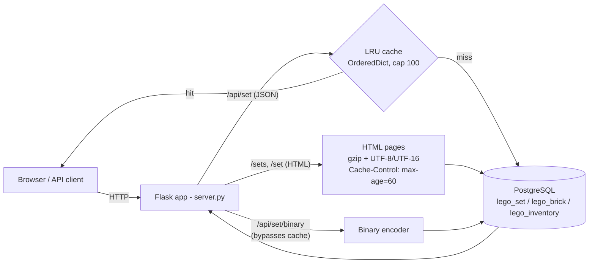

# LEGO Sets Service

A Flask + PostgreSQL web service over a ~21,000-set LEGO dataset, rebuilt for resource efficiency: faster queries, smaller responses, and a testable, cache-backed API.

## Overview

This is a two-student solution to the first mandatory assignment ("Ressurseffektive systemer", oblig 1) in the OsloMet course DAVE3606. The upstream scaffold shipped an unfinished web application with deliberately introduced inefficiencies; the assignment was to find and fix them across the database schema, the request/response path, and the test setup.

The service loads a LEGO catalogue (sets, brick types, and per-set inventories) into PostgreSQL and exposes it as an HTML browse UI, a JSON API, and a custom binary export.

## Problem

The starting code had several resource-efficiency problems typical of an unoptimised application:

- Tables with no primary keys, foreign keys, or indexes, so lookups scanned entire tables.
- An `O(n^2)` HTML builder that took several seconds to render the full set list.
- Uncompressed, single-encoding responses and leaked file handles.
- A database-per-request pattern with no server-side caching.
- Endpoint logic wired directly to a global database connection, making it hard to test.

## Solution

- Added `NOT NULL` constraints, primary keys (including composite keys), foreign keys, and two secondary indexes in the schema migration.
- Replaced string concatenation with list `append` + `"".join(...)` to build the HTML in roughly linear time.
- Added selectable response encoding (UTF-8 / UTF-16) and gzip compression, plus a browser `Cache-Control` header and proper file-handle cleanup.
- Implemented a JSON endpoint, a self-describing binary export format with a matching reader, and a server-side LRU cache.
- Split endpoint logic into standalone functions that receive an injected database object, enabling mock-based unit tests.

## Key features

- **HTML browse UI** — `/sets` lists every set; `/set?id=...` shows a set and its inventory.
- **JSON API** — `/api/set?id=...` returns a set and its bricks, served through an in-process LRU cache.
- **Binary export** — `/api/set/binary?id=...` returns a compact, length-prefixed big-endian format (magic bytes `LEGO`); `read_binary_set.py` decodes it.
- **Response optimisation** — configurable UTF-8/UTF-16 encoding, gzip (`Content-Encoding: gzip`), and `Cache-Control: max-age=60` on the set list.
- **Indexed schema** — primary/foreign keys plus `idx_inventory_brick_type` and `idx_inventory_color` for brick-type and colour lookups.
- **Dependency injection** — endpoints take a `Database` argument, so a `MockDatabase` can drive tests without PostgreSQL.

## Architecture



A new database connection is opened per request. `/api/set` consults the LRU cache before querying; `/sets` relies on the browser cache header; `/api/set/binary` always queries the database.

## Technology stack

- **Language:** Python 3
- **Web framework:** Flask
- **Database:** PostgreSQL 18 (via Docker), accessed with `psycopg` 3
- **Testing:** pytest
- **Data source:** `bricklink.json.gz` (~21,000 sets), imported into PostgreSQL

## Getting started

Prerequisites: Docker, Python 3, and the `bricklink.json.gz` dataset (distributed via the course; see `docs/assignment.md` for the download link).

```bash
# 1. Start a local PostgreSQL container (Postgres 18 on host port 9876).
#    Note: shared_buffers is deliberately tiny (128kB) so index effects are visible.
./create_and_run_database.sh

# 2. Install Python dependencies.
pip install -r requirements.txt

# 3. Create the schema (tables, keys, indexes).
python migrate_database.py

# 4. Place bricklink.json.gz in the repo root, then load the data (~21,000 sets;
#    this takes a few minutes and should be run only once).
python import_into_database.py

# 5. Run the server (serves http://127.0.0.1:5000).
python server.py
```

Database connection settings are read from the standard PostgreSQL environment variables (`PGHOST`, `PGPORT`, `PGDATABASE`, `PGUSER`, `PGPASSWORD`) and fall back to the local Docker defaults if unset. See `.env.example`.

## Testing

Unit tests use dependency injection and a `MockDatabase`, so they run without a live PostgreSQL instance:

```bash
pip install -r requirements.txt pytest
python -m pytest -q
```

Coverage focuses on the pure request-handling logic: HTML set-list rendering, JSON assembly, the binary format round-trip, and LRU cache eviction. Endpoints that require a live database (data import, migration) are not covered by these tests.

## Performance results

The numbers below are as-measured on the authors' hardware and are illustrative, not benchmarks; they will vary by machine and dataset.

- **HTML render (`/sets`):** roughly 6.5 s to about 0.07 s after switching from string concatenation to `append` + `join` (report, p. 5).
- **Response size (`/sets`):** `Content-Length` roughly 2,003,277 bytes originally, to about 332,492 bytes (UTF-8) / 388,337 bytes (UTF-16) (report, pp. 7-8). Most of the reduction comes from gzip; the encoding choice accounts for the difference between the two compressed figures.
- **Indexes and server-side cache:** measured to improve query and repeat-request latency; the report shows these qualitatively via screenshots rather than reproducible figures, so no specific numbers are quoted here.

## Contributions

This was a two-person student team using pull requests and code review. Work was split as recorded on page 1 of the committed report:

- **Jakob (this repository's owner)** — tasks 1, 2, 5, 6: database constraints/keys and indexes, response encoding and compression, the JSON and custom binary file formats, the frontend detail view, and the server-side LRU cache.
- **Teammate (Adam)** — tasks 3, 4, 7: the algorithmic complexity fix for the HTML builder, encoding/compression/file-handle work, and the dependency-injection refactor with mock-based tests.

Both members submitted and reviewed pull requests as part of the workflow.

## Known limitations

These are known issues in the current code, kept honest for reviewers:

- **Charset meta tag never injected.** The template contains `<CHARSET>` while the server replaces `{CHARSET}`, so the placeholder is never substituted.
- **No empty-result guard on set lookup.** `get_set` indexes `result[0]` directly, so an unknown set id raises an `IndexError` (HTTP 500) instead of returning 404.
- **Binary endpoint bypasses the cache.** `/api/set/binary` always hits the database.
- **A new database connection is opened per request** (no pooling), and the server runs with `debug=True`.
- **Thin test coverage.** Encoding, gzip, the `Cache-Control` header, and error paths are not directly tested.
- **Local dev credentials.** The Docker Postgres uses a throwaway password baked into the setup scripts. It is a local-only scaffold credential from the course, not a production secret; connection settings can now be overridden via environment variables (see `.env.example`).

## Project status

Complete. This is a submitted, graded university course assignment. It is not maintained as a production service, and the limitations above are intentionally left documented rather than patched.

## License

No license file is present in this repository. If reuse is intended, add an explicit license.

## Further reading

- [`docs/assignment.md`](docs/assignment.md) — the original assignment brief and full setup instructions.
- `Ressurseffektive oblig 1 draft.pdf` — the project report with design decisions and answers to the theory questions.
